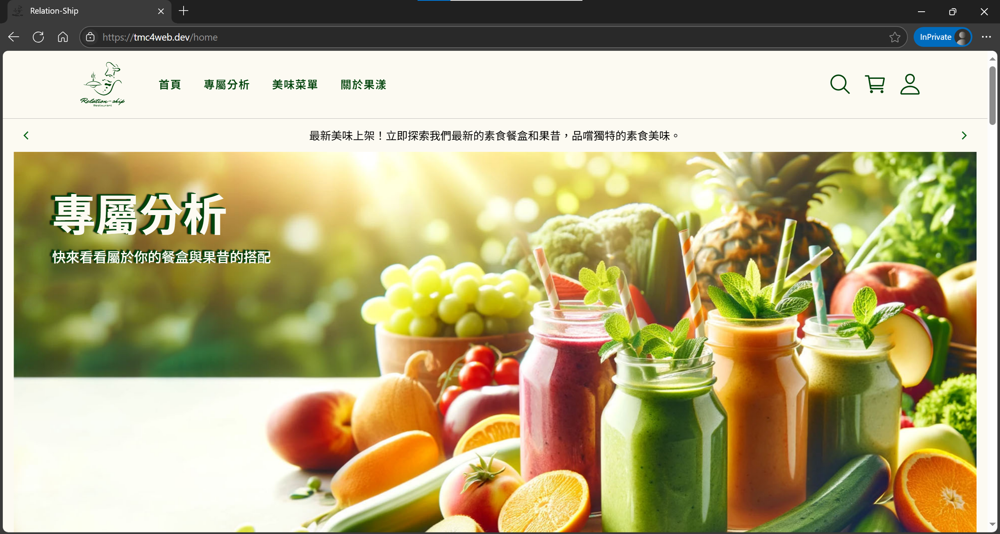
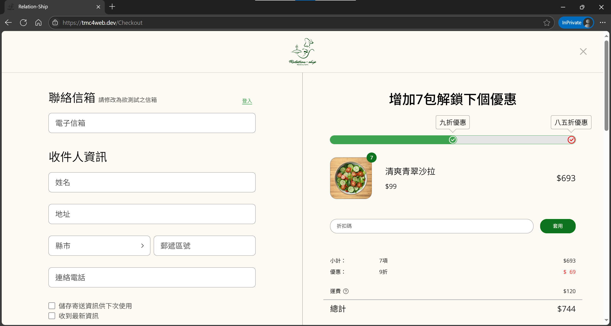
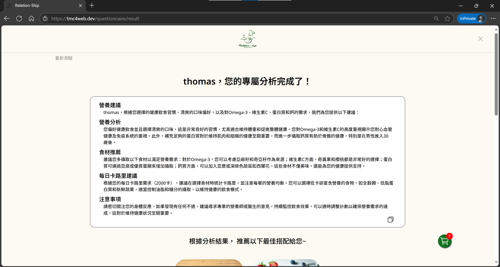

# Relation-Ship 蔬食沙拉與果昔 &nbsp;   

<h3>
一個以 Vue 3 打造的蔬食電商網站。  
此專案為個人 side project 使用，從前端畫面設計、API 開發、資料庫架構到部署流程，完整涵蓋電商網站建構所需的關鍵環節，旨在模擬一個完整的前、後端實務流程。
</h3>

## 網站 Demo

<!-- [Relation-Ship](https://tmc4web.dev) -->

## 網站畫面

  
首頁

  

  
付款

  

  
問卷

  

## 架構設計

本專案採用前後端分離架構，透過 Nginx 做為反向代理伺服器，處理前端靜態資源與後端 API 請求，並部署於 GCP Compute Engine，搭配 Cloudflare 提供 DNS 與 CDN 服務，強化效能與安全性。資料層使用 MongoDB 儲存，並以 Redis 快取常用資料。此外，整合多項第三方 API（如金流、登入、地區查詢、ChatGPT 等）提供完整電商功能體驗。

## 技術棧

### 使用語言：
- [TypeScript](https://www.typescriptlang.org/)

### 前端框架：
- [Vue 3](https://vuejs.org/)
- [Vite](https://vitejs.dev/)
- [Pinia](https://pinia.vuejs.org/) 狀態管理
- [Vue Router](https://router.vuejs.org/) 路由系統

### 後端框架：
- [Express](https://expressjs.com/) - API Server

### 資料庫：
- [MongoDB](https://www.mongodb.com/) - 資料庫
- [Redis](https://redis.io/) - 資料庫快取

### 部署與 DevOps：
- [Nginx](https://nginx.org/) - 反向代理
- [GCP Compute Engine](https://cloud.google.com/compute) - 部署環境
- [GitHub Actions](https://github.com/features/actions) - 自動化部屬
- [Cloudflare](https://www.cloudflare.com/) - DNS 服務

## 功能特色

### UI 技術與互動
- 主要使用 Scss 搭配 Tailwind CSS ，搭建網站樣式
- RWD 響應式設計，兼容手機、平板與桌機
- [Swiper.js](https://swiperjs.com/) 輪播與 [GSAP](https://gsap.com/) 動畫，提升使用者體驗
- 表單驗證使用 Vee-Validate + Yup 確保資料安全與正確性
- 整合 [Fuse.js](https://fusejs.io/)，提供商品模糊搜尋

### 電商功能
- 商品瀏覽與購買
- 加入購物車、編輯商品數量
- 模擬下單流程
- 訂單查詢與取消

### 使用者系統
- 註冊 / 登入 / 登出
- Google 第三方登入（OAuth 2.0）

### 金流與信件
- 串接綠界金流（ECPay）
- 使用 Nodemailer 搭配 Google OAuth 自動寄送系統信件

### 地區與地址
- 訂單地址郵遞區號自動補全 [台灣 3+2 / 3+3郵遞區號 查詢](https://zip5.5432.tw/zip5api.html)
- 行政區域縣市、鄉鎮市區選單 [全國土地基本資料庫代碼資料服務](https://cop.land.moi.gov.tw/ServiceList/ServiceData?id=A5CCC85A-EEF3-4659-8829-DA21CD0DCC95)

### AI 功能
- ChatGPT API 串接，根據問卷結果進行分析

### 後端設計
- 使用 Express 搭建 RESTful API server
- 部分 API 使用 GraphQL 提供另類資料查詢方式
- 使用 Mongoose 操作 MongoDB，作為主要資料儲存
- 使用 node-cron 排程腳本自動執行背景任務

### 使用者驗證與安全性
- 本地帳號密碼驗證（bcrypt 加密處理）
- 使用 JWT 處理前後端驗證邏輯，搭配 jwt-decode 處理 Token 資訊

### 效能優化
- Redis 快取需高頻率存取之數據
- 使用 vite-plugin-imagemin 壓縮靜態圖片資源

### 自動佈署
  - GitHub Actions 自動打包、部屬至 GCP Compute Engine

## 外部 API 與服務整合

| 功能 | 使用技術 / API |
|------|----------------|
| 第三方登入 | Google OAuth 2.0 |
| 金流串接 | 綠界金流 |
| 郵遞區號自動填寫 | [台灣 3+2 / 3+3郵遞區號 查詢](https://zip5.5432.tw/zip5api.html) |
| 行政區域查詢 | [全國土地基本資料庫代碼資料服務](https://cop.land.moi.gov.tw/ServiceList/ServiceData?id=A5CCC85A-EEF3-4659-8829-DA21CD0DCC95) |
| 系統信寄送 | Nodemailer + Gmail OAuth |
| 問卷分析 | ChatGPT API |

##  開發心得

此專案從前端設計、API 開發、資料庫架構到部署流程，並整合多項外部 API，讓我收穫大量前、後端的相關知識。開發過程中深入理解了 SPA 架構、OAuth 流程、金流串接與佈署上線等完整網站製作流程。

## License

MIT